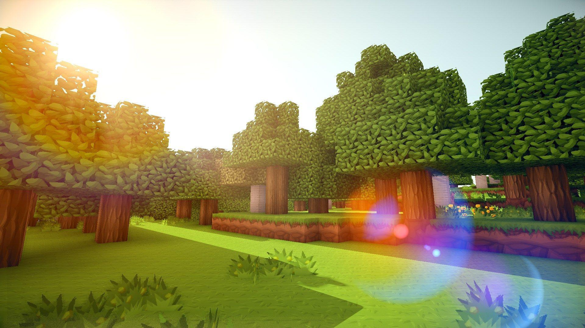

# Minecraft Item Identifier

### Detectable items
  * Ender Pearls
  * Blaze Rods
  * Diamonds
  * Sticks
  * Diamond Pickaxes
  * Oak Planks
  * Ancient Debris

### Instruction to run it locally
1. download anaconda from the internet
2. open the terminal, and git clone this repo by running \
`git clone https://github.com/ryanqin/SC2022-BatchD-CV-GoldenGorillas.git`
3. change directoray to app by running \
`cd app`
4. create an environment by running the following command in the terminal. \
`conda env create -f CVReq.yml -n cv_env`
5. once finish, make sure you are in the new created environment by running \
`conda activate cv_env`
6. now you can run the website by the following command \
`python3 -m main`
7. use the first website link that you see in the terminal to access the website
8. use control+c in the terminal to stop the website
9. you can deactive the environment by running the following command in terminal \
`conda deactivate` or `source deactivate`
